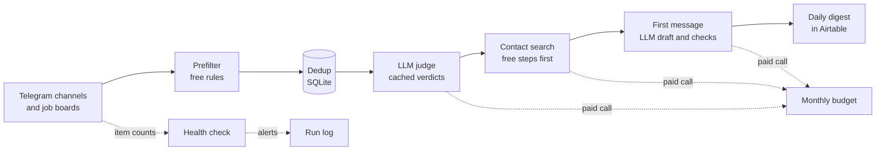

# Job Radar

[](https://github.com/ahrimmedia-beep/job-radar/actions/workflows/ci.yml)

A Python system that finds fresh vacancies and the people who hire for them. Every day it collects posts from Telegram channels and job boards, removes duplicates, asks an LLM which vacancies fit, finds a contact for each one and drafts a first message. The result is a daily list of cards in Airtable, ready to work with.

## The problem

Vacancies for one profile are spread over dozens of Telegram channels and job boards. The same post is reposted many times under new IDs. Most posts do not fit. Many have no personal contact, only a shared HR mailbox or a form. Reading all of this by hand takes a lot of time every day, and the best moment to write is early, while a post has few replies.

## What I built

- Collectors for Telegram channels and job boards. If one source fails, the run goes on with the others.
- A free prefilter that runs before any paid step. It drops resumes and short posts and splits list posts ("10 vacancies in one message") into single vacancies.
- Deduplication by a content fingerprint, so a repost with a new message ID is still the same vacancy. Reposts are counted by day.
- An LLM judge that decides if a vacancy fits and gives a one-line reason. Verdicts are cached per post and per prompt version, so the same post is not paid for twice.
- Contact search. Contacts come only from regular expressions over the source text, and each one must appear in that text word for word. The model never writes a contact. The daily run uses only free lookups in its own data. Paid lookups run only on request, for example for vacancies that I marked as applied.
- A first message for each vacancy, drafted by the LLM. Every number and name in the draft is checked against the vacancy text and a list of known facts. A draft that fails the check is dropped.
- A monthly budget cap for all paid calls, and a health check that alerts when a source suddenly returns nothing.
- Delivery to an Airtable table. A card is marked as delivered only after the push is confirmed. Status fields in the table belong to the user. The system reads them and never writes them.

## How it works



Cheap steps run first and paid steps run last, on fewer posts. Rules and SQLite lookups cost nothing, so they remove resumes, duplicates and already delivered posts before the LLM sees anything. Every paid call checks the monthly budget first and writes its cost to a log. SQLite is the single source of truth: one file, no ORM. The system runs on a schedule on a Linux server.

## Selected code

This repository holds four real modules from the system, with their tests, to show how the code is written. The full project has about 500 tests. The LLM prompts, the relevance rules, the source list, the contact search steps, the message generator and the deployment setup stay private.

| File | What it shows |
|---|---|
| [`jobradar/contacts.py`](jobradar/contacts.py) | Contact extraction with regular expressions: email, Telegram, LinkedIn and phone. It skips role mailboxes, image file names that look like emails, and handles of other messengers. A contact counts only if it appears in the source text word for word. |
| [`jobradar/dedup.py`](jobradar/dedup.py) | People are merged only by LinkedIn slug, personal email or Telegram handle, never by name or company. A content fingerprint finds reposts. Reposts are counted by day, and a card is marked as delivered only after a confirmed send. |
| [`jobradar/spend.py`](jobradar/spend.py) | A spend log and a monthly budget cap with an inclusive limit. Every paid step checks it before a call: the LLM judge, the message drafts and paid lookups. |
| [`jobradar/health.py`](jobradar/health.py) | Source health check. It alerts after two empty runs in a row, or when a run drops below 30% of the 7-day median. |
| [`jobradar/db.py`](jobradar/db.py), [`jobradar/models.py`](jobradar/models.py) | The part of the SQLite schema and the data types that these modules need, with a safe migration for an existing database. |

```bash
python -m venv .venv && source .venv/bin/activate
pip install -e ".[dev]"
pytest             # 50 tests, Python 3.11+
ruff check .
```

## Stack

Python 3.11+ with the standard library only, SQLite, OpenAI API, Airtable API, Telegram, pytest, systemd timers on a Linux server.

## My role

I built the system alone: architecture, data collection, the LLM pipeline, contact search, tests and deployment.

## License

Published for viewing only. All rights reserved, see [LICENSE](LICENSE).
